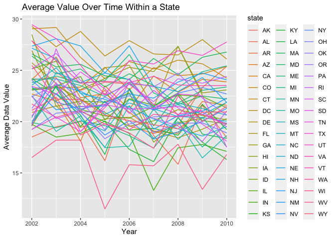
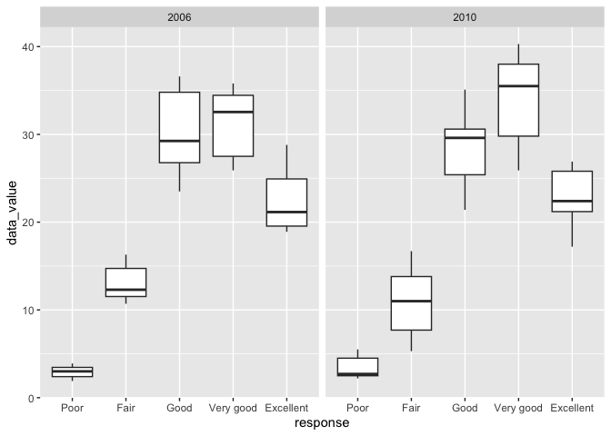
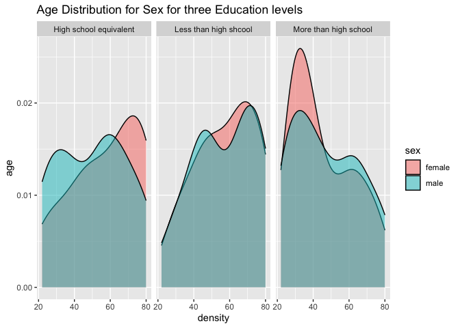

p8105_hw3_zj2379_2
================
Zheshu Jiang
2023-10-15

problem 1 part 1 for first try, I have done the hw two days before, but
I tried to make some changes, i found i could only update rmd file but
not md file, so i am doing it again, my previous hw3 link is
<https://github.com/jzs43/p8105_hw3_zj2379/tree/main> for reference

## Problem1

``` r
library(p8105.datasets)
data("instacart")
library(tidyverse)
```

    ## ── Attaching core tidyverse packages ──────────────────────── tidyverse 2.0.0 ──
    ## ✔ dplyr     1.1.3     ✔ readr     2.1.4
    ## ✔ forcats   1.0.0     ✔ stringr   1.5.0
    ## ✔ ggplot2   3.4.3     ✔ tibble    3.2.1
    ## ✔ lubridate 1.9.2     ✔ tidyr     1.3.0
    ## ✔ purrr     1.0.2     
    ## ── Conflicts ────────────────────────────────────────── tidyverse_conflicts() ──
    ## ✖ dplyr::filter() masks stats::filter()
    ## ✖ dplyr::lag()    masks stats::lag()
    ## ℹ Use the conflicted package (<http://conflicted.r-lib.org/>) to force all conflicts to become errors

``` r
library(ggridges)
library(patchwork)
```

``` r
instacart |> 
  count(aisle) |> 
  arrange(desc(n))
```

    ## # A tibble: 134 × 2
    ##    aisle                              n
    ##    <chr>                          <int>
    ##  1 fresh vegetables              150609
    ##  2 fresh fruits                  150473
    ##  3 packaged vegetables fruits     78493
    ##  4 yogurt                         55240
    ##  5 packaged cheese                41699
    ##  6 water seltzer sparkling water  36617
    ##  7 milk                           32644
    ##  8 chips pretzels                 31269
    ##  9 soy lactosefree                26240
    ## 10 bread                          23635
    ## # ℹ 124 more rows

There are 134 aisles, with fresh vegetables and fresh fruits holding the
most items ordered.

Make a plot that shows the number of items ordered in each aisle,
limiting this to aisles with more than 10000 items ordered. Arrange
aisles sensibly, and organize your plot so others can read it.

``` r
instacart |> 
  count(aisle) |> 
  filter(n > 10000) |> 
  mutate(aisle = fct_reorder(aisle, n)) |> 
  ggplot(aes(x = aisle, y = n)) + 
  geom_point() + 
  labs(title = "Number of items ordered in each aisle")+
  theme(axis.text.x = element_text(angle = 60, hjust = 1))
```

<!-- -->

Make a table showing the three most popular items in each of the aisles
“baking ingredients”, “dog food care”, and “packaged vegetables fruits”.
Include the number of times each item is ordered in your table.

``` r
instacart |> 
  filter(aisle %in% c("baking ingredients", "dog food care", "packaged vegetables fruits")) |>
  group_by(aisle) |> 
  count(product_name) |> 
  mutate(rank = min_rank(desc(n))) |> 
  filter(rank < 4) |> 
  arrange(desc(n)) |>
  knitr::kable()
```

| aisle                      | product_name                                  |    n | rank |
|:---------------------------|:----------------------------------------------|-----:|-----:|
| packaged vegetables fruits | Organic Baby Spinach                          | 9784 |    1 |
| packaged vegetables fruits | Organic Raspberries                           | 5546 |    2 |
| packaged vegetables fruits | Organic Blueberries                           | 4966 |    3 |
| baking ingredients         | Light Brown Sugar                             |  499 |    1 |
| baking ingredients         | Pure Baking Soda                              |  387 |    2 |
| baking ingredients         | Cane Sugar                                    |  336 |    3 |
| dog food care              | Snack Sticks Chicken & Rice Recipe Dog Treats |   30 |    1 |
| dog food care              | Organix Chicken & Brown Rice Recipe           |   28 |    2 |
| dog food care              | Small Dog Biscuits                            |   26 |    3 |

Finally is a table showing the mean hour of the day at which Pink Lady
Apples and Coffee Ice Cream are ordered on each day of the week. This
table has been formatted in an untidy manner for human readers. Pink
Lady Apples are generally purchased slightly earlier in the day than
Coffee Ice Cream, with the exception of day 5.

Make a table showing the mean hour of the day at which Pink Lady Apples
and Coffee Ice Cream are ordered on each day of the week; format this
table for human readers (i.e. produce a 2 x 7 table).

``` r
instacart |>
  filter(product_name %in% c("Pink Lady Apples", "Coffee Ice Cream")) |>
  group_by(product_name, order_dow) |>
  summarize(mean_hour = mean(order_hour_of_day)) |>
  pivot_wider(
    names_from = order_dow, 
    values_from = mean_hour) |>
  knitr::kable(digits = 2)
```

    ## `summarise()` has grouped output by 'product_name'. You can override using the
    ## `.groups` argument.

| product_name     |     0 |     1 |     2 |     3 |     4 |     5 |     6 |
|:-----------------|------:|------:|------:|------:|------:|------:|------:|
| Coffee Ice Cream | 13.77 | 14.32 | 15.38 | 15.32 | 15.22 | 12.26 | 13.83 |
| Pink Lady Apples | 13.44 | 11.36 | 11.70 | 14.25 | 11.55 | 12.78 | 11.94 |

## Problem 2

``` r
#load the data
library(p8105.datasets)
data("brfss_smart2010")
brfss_smart2010
```

    ## # A tibble: 134,203 × 23
    ##     Year Locationabbr Locationdesc     Class Topic Question Response Sample_Size
    ##    <int> <chr>        <chr>            <chr> <chr> <chr>    <chr>          <int>
    ##  1  2010 AL           AL - Jefferson … Heal… Over… How is … Excelle…          94
    ##  2  2010 AL           AL - Jefferson … Heal… Over… How is … Very go…         148
    ##  3  2010 AL           AL - Jefferson … Heal… Over… How is … Good             208
    ##  4  2010 AL           AL - Jefferson … Heal… Over… How is … Fair             107
    ##  5  2010 AL           AL - Jefferson … Heal… Over… How is … Poor              45
    ##  6  2010 AL           AL - Jefferson … Heal… Fair… Health … Good or…         450
    ##  7  2010 AL           AL - Jefferson … Heal… Fair… Health … Fair or…         152
    ##  8  2010 AL           AL - Jefferson … Heal… Heal… Do you … Yes              524
    ##  9  2010 AL           AL - Jefferson … Heal… Heal… Do you … No                77
    ## 10  2010 AL           AL - Jefferson … Heal… Unde… Adults … Yes              316
    ## # ℹ 134,193 more rows
    ## # ℹ 15 more variables: Data_value <dbl>, Confidence_limit_Low <dbl>,
    ## #   Confidence_limit_High <dbl>, Display_order <int>, Data_value_unit <chr>,
    ## #   Data_value_type <chr>, Data_Value_Footnote_Symbol <chr>,
    ## #   Data_Value_Footnote <chr>, DataSource <chr>, ClassId <chr>, TopicId <chr>,
    ## #   LocationID <chr>, QuestionID <chr>, RESPID <chr>, GeoLocation <chr>

First, do some data cleaning: format the data to use appropriate
variable names; focus on the “Overall Health” topic include only
responses from “Excellent” to “Poor” organize responses as a factor
taking levels ordered from “Poor” to “Excellent”

``` r
#do some data cleaning following the above guideline
brfss_smart = 
  brfss_smart2010 |> 
  as_tibble()
brfss_smart = 
  brfss_smart |>
  janitor::clean_names() |>
  rename(state = locationabbr, location_state = locationdesc) |>
  filter(topic %in% "Overall Health") |>
  mutate(response = fct_relevel(response, "Poor","Fair","Good","Very good","Excellent"))
```

``` r
# keep only data from 2002 to see which states were observed at 7 or more locations
brfss_smart |>
  filter(year == "2002") |>
  group_by(state) |>                                                    
  summarize(n = n_distinct(location_state)) |>  
  filter(n >= 7)
```

    ## # A tibble: 6 × 2
    ##   state     n
    ##   <chr> <int>
    ## 1 CT        7
    ## 2 FL        7
    ## 3 MA        8
    ## 4 NC        7
    ## 5 NJ        8
    ## 6 PA       10

This plot shows a line for each state across years from 2002 to 2010. In
2002, CT, FL, MA, NC, Nj, PA were observed at 7 or more locations.

``` r
# keep only data from 2010 to see which states were observed at 7 or more locations
brfss_smart |>
  filter(year == "2010") |>
  group_by(state) |>                                                    
  summarize(n = n_distinct(location_state)) |>  
  filter(n >= 7)
```

    ## # A tibble: 14 × 2
    ##    state     n
    ##    <chr> <int>
    ##  1 CA       12
    ##  2 CO        7
    ##  3 FL       41
    ##  4 MA        9
    ##  5 MD       12
    ##  6 NC       12
    ##  7 NE       10
    ##  8 NJ       19
    ##  9 NY        9
    ## 10 OH        8
    ## 11 PA        7
    ## 12 SC        7
    ## 13 TX       16
    ## 14 WA       10

In 2010, CA, CO, FL, MA, MD, NC, NE, NJ, HY, OH, PA, SC, TX, WA were
observed at 7 or more locations.

make a plot showing a line for each state across years

``` r
  brfss_smart |>
  filter(response=="Excellent")|>
  select(year, state, data_value)|>
  group_by(year, state)|>
  summarise(average_data_value = mean(data_value))|>
  ggplot(aes(x = year, y = average_data_value, color = state, group = state)) +
  geom_line()+
  labs(
    x = "Year",
    y = "Average Data Value",
    title = "Average Value Over Time Within a State"
  )
```

    ## `summarise()` has grouped output by 'year'. You can override using the
    ## `.groups` argument.

    ## Warning: Removed 3 rows containing missing values (`geom_line()`).

<!-- -->

``` r
ggsave("line plot for each state.pdf")
```

    ## Saving 7 x 5 in image

    ## Warning: Removed 3 rows containing missing values (`geom_line()`).

This plot shows a line for each state across years from 2002 to 2010.

Make a two-panel plot showing, for the years 2006, and 2010

``` r
brfss_smart |>
  group_by(year,response,state,data_value) |>
  filter(year %in% c("2006","2010")) |>
  filter(state %in% "NY")|>
  ggplot(aes(x = response, y = data_value)) + 
  geom_boxplot() + 
  facet_grid(. ~ year)
```

<!-- -->

``` r
  ggsave("two-panel plot for 2006 and 2010.pdf")
```

    ## Saving 7 x 5 in image

This plot shows the distribution of data_value for responses (“Poor” to
“Excellent”) among locations in NY State in 2006 and 2010 respectively.
Based on the graphs, the group with “poor” responses has the lowest data
values at both years, good and very good responses have relatively high
data values.

## Problem3

``` r
nhanes_covar = 
  read_csv("nhanes_covar.csv",skip = 4) |>
  janitor::clean_names() |>
  # exclude participants less than 21 years of age
  filter(age > 21) |>
  mutate(
    sex = recode(sex, "1" = "male", "2" = "female"),
      education = recode(
      education, 
      "1" = "Less than high shcool", 
      "2" = "High school equivalent",
      "3" = "More than high school"),
  )|>
 mutate(
   sex = as.factor(sex), 
   education = as.factor(education)
 )|>
  #exclude those observations with missing demographic data
  na.omit() 
```

    ## Rows: 250 Columns: 5
    ## ── Column specification ────────────────────────────────────────────────────────
    ## Delimiter: ","
    ## dbl (5): SEQN, sex, age, BMI, education
    ## 
    ## ℹ Use `spec()` to retrieve the full column specification for this data.
    ## ℹ Specify the column types or set `show_col_types = FALSE` to quiet this message.

``` r
nhanes_covar
```

    ## # A tibble: 225 × 5
    ##     seqn sex      age   bmi education             
    ##    <dbl> <fct>  <dbl> <dbl> <fct>                 
    ##  1 62161 male      22  23.3 High school equivalent
    ##  2 62164 female    44  23.2 More than high school 
    ##  3 62174 male      80  33.9 More than high school 
    ##  4 62177 male      51  20.1 High school equivalent
    ##  5 62178 male      80  28.5 High school equivalent
    ##  6 62180 male      35  27.9 More than high school 
    ##  7 62184 male      26  22.1 High school equivalent
    ##  8 62189 female    30  22.4 More than high school 
    ##  9 62199 male      57  28   More than high school 
    ## 10 62202 male      36  24.7 Less than high shcool 
    ## # ℹ 215 more rows

``` r
nhanes_accel = 
  read_csv("nhanes_accel.csv") |>
  janitor::clean_names()|>
   pivot_longer(                                           
    min1:min1440,
    names_to = "number",
    values_to = "counts",
    names_prefix = "min"
  )
```

    ## Rows: 250 Columns: 1441
    ## ── Column specification ────────────────────────────────────────────────────────
    ## Delimiter: ","
    ## dbl (1441): SEQN, min1, min2, min3, min4, min5, min6, min7, min8, min9, min1...
    ## 
    ## ℹ Use `spec()` to retrieve the full column specification for this data.
    ## ℹ Specify the column types or set `show_col_types = FALSE` to quiet this message.

``` r
nhanes_accel
```

    ## # A tibble: 360,000 × 3
    ##     seqn number counts
    ##    <dbl> <chr>   <dbl>
    ##  1 62161 1       1.11 
    ##  2 62161 2       3.12 
    ##  3 62161 3       1.47 
    ##  4 62161 4       0.938
    ##  5 62161 5       1.60 
    ##  6 62161 6       0.145
    ##  7 62161 7       2.10 
    ##  8 62161 8       0.509
    ##  9 62161 9       1.63 
    ## 10 62161 10      1.20 
    ## # ℹ 359,990 more rows

``` r
# combine the two datasets
nhanes_df = left_join(nhanes_covar,nhanes_accel,by = "seqn")
```

Produce a reader-friendly table for the number of men and women in each
education category, and create a visualization of the age distributions
for men and women in each education category.

``` r
#make a table
education_table=select(nhanes_covar, sex | education)  
table(education_table)
```

    ##         education
    ## sex      High school equivalent Less than high shcool More than high school
    ##   female                     23                    28                    59
    ##   male                       34                    27                    54

At the High school equivalent education level, the number of male is 34
and the number of female is 23, more male than female. At less than high
school education level,the number of male is 28 and the number of female
is 27, more male than female. At more than high school education
level,the number of male is 59 and the number of female is 54, more male
than female.

``` r
nhanes_covar |>
ggplot(aes(x = age, fill = sex )) +
  geom_density(alpha = .5) +
  facet_grid(. ~ education)+
  labs( title = "Age Distribution for Sex for three Education levels",
    y = "age",
    x = "density")
```

<!-- -->

``` r
ggsave("Age Distribution for Sex for three Education levels.pdf")
```

    ## Saving 7 x 5 in image

Based on the graphs, at the high school equivalent education level, the
number of females exceeds the number of males as age increases. At the
less than high school education level, the number of females first
exceeds the number of males then becomes lower than that of males as age
increases. At the more than high school education level, the number of
females is originally higher than the number of males and then becomes
lower than that of males as age increases.Overall, females and younger
people have relatively higher education level than other age groups.
